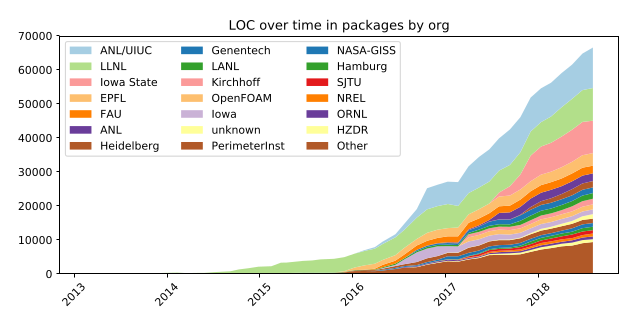
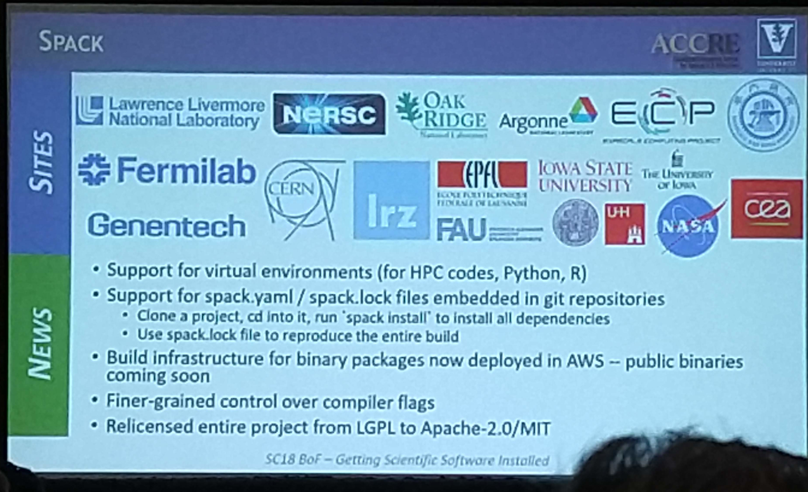

# Spack

<a href=https://spack.io></a>

CLAM 20190308

Levi Baber

http://rit.las.iastate.edu
---
layout: true
class: footer-logo
---

## Software packaging with Spack

[Spack] is an open source, flexible software packaging tool written in python, targeted at research computing applications

Spack builds packages and creates module files in Lmod, tcl, or dotkit format (we use Lmod).

We've been using [Spack] to build scientific software for about a year and a half

Spack is growing quickly:

Currently contains ~3K packages



[Spack]: https://spack.io
---

## Getting Started

Using spack is (generally) as simple as cloning the repo, sourcing a setup script, and running

Few dependencies to get started (a compiler, curl, tar, etc.)

```
yum -y install git python3 gcc gcc-c++ \
gcc-gfortran curl gnupg2 sed patch \
unzip gzip bzip2 \
findutils make vim 

git clone https://github.com/spack/spack.git

. spack/share/spack/setup-env.sh

spack install r
```
---

## Digging a little deeper

The core function of spack is managing dependencies.  Spack does this using the concretizer.  The concretizer is what takes an abstract specification (spec) like `r` and uses a directed acyclic graph [DAG](https://en.wikipedia.org/wiki/Directed_acyclic_graph) to produce a 'concrete' spec, which includes all of the details like which version of r, which options (variants), which version & options of all the dependencies, etc.

To see the spec, and understand what spack is going to install you can use the `spack spec` command:
```
$ spack spec -lI cdbfasta
Input spec
--------------------------------
 -   cdbfasta

Concretized
--------------------------------
 -   em6lz4l  cdbfasta@2017-03-16%gcc@4.8.5 arch=linux-centos7-x86_64 
 -   64vg6e4      ^zlib@1.2.11%gcc@4.8.5+optimize+pic+shared arch=linux-centos7-x86_64 

```

Each concrete spec is represented by a hash, which includes the DAG for all of the dependencies, the patches, the versions, etc.  If any of those change, the hash changes.

---
## Quick concepts

To see all packages available to install `spack list`, or to search for a particular package `spack list openfoam`.

To see packages you have already installed `spack find`, or `spack find -l openfoam`

To make spack really useful, you'll need to do some setup. Look at what others have done: https://github.com/spack/spack-configs

You can install other compilers via spack, and then use those in subsequent spack installs: `spack install gcc@8.2.0`

`spack graph` is fun to look at, but I don't use it much in practice:

<pre>spack graph namd   
o  namd
<font color="#4E9A06">|</font><font color="#CC0000">\</font>
o <font color="#CC0000">| </font> fftw
<font color="#CC0000">|/</font>
o  charmpp
</pre>

---
## Things to watch out for

### Duplicate installs

* probably want to track develop to get the latest packages
    * packages change often
    * are not always backwards compatible
    * spack has a desire to always install the newest version

This can be avoided, but can be lot of work to do manually, e.g.
```
spack spec -lI openmpi ^hwloc/gold444 ^libfabric/rz4zjo6
```

I recommend either tracking a release and doing one build-tree per release, or using your own release cycle along with some CI/CD pipeline (we have plans in the works for this)

### Default Variants

The default options are not always what you'll want. Use `spack info openfoam` to see the available variants, ahd model those out via `spack spec` before running the install.  Prime examples: `python+tk+ucs4` or `r+X+external-lapack`

---
## Live Demo & Questions


---
## Give me more!

### Try it out

* Install spack on your machines, build the packages you need
* Talk to [ResearchIT](emailto:researchit@iastate.edu) about using our nfs mounts for 1k+ pre-built packages

### Read the docs

* Spack docs: https://spack.readthedocs.io/en/latest/
* Latest tutorial: https://spack.io/slides/Spack-ECP19-Tutorial.pdf

### Plug for PEARC19 tutorial

Submitted a tutorial for PEARC19 in Chicago July 28 - Aug 1
https://www.pearc19.pearc.org/

If accepted, plan for half or full day tutorial
