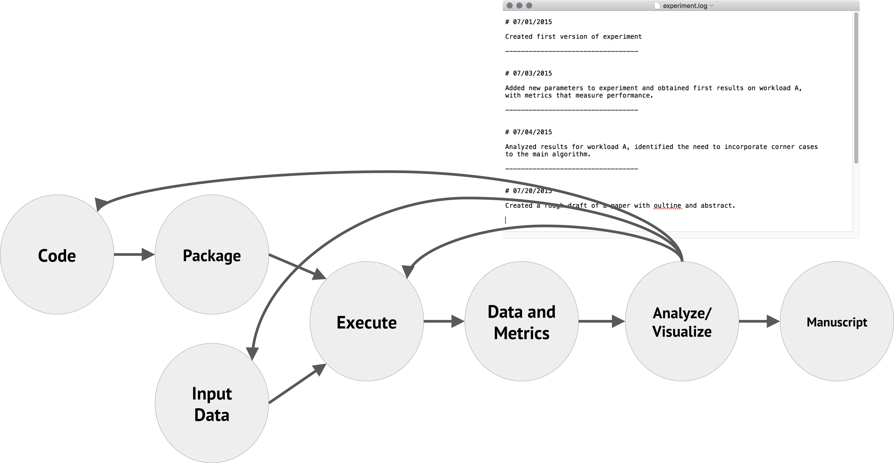

# Tools & Methods for Reproducibile Research


### Topics

* Why reproducibility & replicability matter
* Challenges
* Tools and resources available to help
* References

Levi Baber : http://rit.las.iastate.edu

---

# Why reproducibility and replicability matter

Definitions used in this presentation:

* Reproducibility: Ability to get the same numerical results with the same data and methods
* Replicability: Ability to draw the same conclusions with similar data and methods

Who cares? Funding agencies & publishers
* It is becoming more common for funders and publishers to require
projects to provide comprehensive data management plans, and/or to require
compliance with a standard like Popper or use of a tool like OSF to ensure
that data and methods are available, and the research is reproducibile.

Effectiveness - When less time is spent on working through the details of a prior
study, more time can be spent on new discoveries.

Efficiency - Reproducible research puts less strain on the system by
providing enough detail for others to build on your work in the future
with less overhead

???
The definitions are widely debated, and not settled on.
Using these definitions in the presentation because it's what I'm most comfortable with from prior reading.

---

# Challenges
### Methods and Data

Keeping close track of your research methods is a key
to producing reproducibile research, but so is your data.

Ideally, your published project should contain all of the
scripts, manual steps, dead ends, etc. produced throughout
the course of your project that got you to your end state.

Don't run anything by hand. Everything should be a script in a
git repo.
Use tools like Jupyter Notebook for interactivity, and save the result in a git repo.

Your failures are important for other people in order to move
science forward - don't throw them away.

---

# Challenges
### Technical considerations

Fully recreating a computational environment is not
trivial, and can lead to many hours of frustration by
researchers.  Thinking up front about how you'll share
your research will help make it easier for you and others
to build on in the future.

Why is this so hard?
* Software dependencies are complicated
* Hardware differences
* Numerical reproducibility (floating point errors)
* Learning git

Consult with [ResearchIT] for help getting projects setupSingularity-Hub
using the tools available to make this easier.

[ResearchIT]: http://rit.las.iastate.edu

---

# Tools and resources to help
### Project management with [OSF]

The Open Science Framework is a free and open source
tool that makes it easy for researchers to manage the full research cycle from
conception through publication.

Features include:
* Separate projects
* Collaboration with permission controls
* Wiki
* Data tracking
* Version control
* Integration with common tools like Box, GitHub, [figshare], etc.
* Ability to share results, raw data, generate [DOI]'s, etc.

For more information on how to use [OSF] at Iowa State: http://researchit.las.iastate.edu/open-science-framework

[OSF]:https://osf.io/
[figshare]: https://figshare.com
[DOI]: https://www.doi.org/

---
# Tools and resources to help
### Project workflows with [Popper]

Popper provides conventions and a workflow processes
for tracking your research project.  Popper makes
it easier to use tools like scripts, containers, and
automated software package installation to stitch
together your project workflow along with documentation.




[Popper]: http://falsifiable.us
---

# Tools and resources to help
### Package Management with [Spack]

A variety of tools are available to help make software installation
and management easier, with different focuses (ease of use, compatibility, reproducibility, etc.)

* [Spack] is the best option we've found for scientific reproducibility and ease of use
* Research IT has contributed several hundred packages so far
* We're currently installing a new software tree for the University based on Spack
* You can also use [Spack] in your home directory as an easy way to install
packages

---
# Tools and resources to help
### Package Management with [Spack]

[Spack] creates a package spec & hash via a dependency graph for each package based on its
dependencies and configuration options.  You can use the spec to verify installations
on another system, or to share with colleagues attempting to reproduce your research.

The graph:

.small[
```bash

o  samtools
|\
| o  htslib
| |\
| | |\
| o | |  zlib
|  / /
| o |  xz
|  /
o |  ncurses
o |  pkg-config
 /
o  bzip2
```
]

---

# Tools and resources available to help
### Package Management with [Spack]

The spec:
.small[
```bash

Input spec
--------------------------------
samtools

Concretized
--------------------------------
vjstbcc  samtools@1.6%gcc@6.4.1 arch=linux-fedora25-x86_64
3e2nn4i      ^htslib@1.6%gcc@6.4.1 arch=linux-fedora25-x86_64
dmvuk2s          ^bzip2@1.0.6%gcc@6.4.1+shared arch=linux-fedora25-x86_64
wpfddzd          ^xz@5.2.3%gcc@6.4.1 arch=linux-fedora25-x86_64
ct3ya7h          ^zlib@1.2.11%gcc@6.4.1+optimize+pic+shared arch=linux-fedora25-x86_64
ovacyo2      ^ncurses@6.0%gcc@6.4.1 patches=4110a40613b800da2b2888c352b64c75a82809d48341061e4de5861e8b28423f,f84b2708a42777aadcc7f502a261afe10ca5646a51c1ef8b5e60d2070d926b57 ~symlinks~termlib arch=linux-fedora25-x86_64
u6vweto          ^pkg-config@0.29.2%gcc@6.4.1+internal_glib arch=linux-fedora25-x86_64
```
]

While Spack is very good, it's not trivially reproducibile since there can
be dependencies on external packages and libraries that may vary by system.

[Spack]: http://spack.readthedocs.io/
---

# Tools and resources available to help
### Containers

A container shares the kernel with the host computer, but provides
its own filesystem and processes run in isolation.  A container can
be thought of similarly to a virtual machine, but lighter weight and more portable.

* Good tool for ease of software install & replicability
* Portable for moving from local compute to Xsede or elsewhere
* Once your image is built, your software stack is set and documented
* Your image is verifiable, and can easily be shared

We use [Singularity] for containers on our HPC systems.  You can find containers on
[Singularity-Hub] or build your own.  Singularity can run or build on [Docker] images.

[Singularity]: http://singularity.lbl.gov
[Singularity-Hub]: https://www.singularity-hub.org/
[Docker]: https://www.docker.com/
---

# Tools and resources available to help
### Containers

An example Singularity recipe from https://github.com/researchit/ete3:
.small[
```bash

Bootstrap: docker
From: fedora

%environment
    PATH=/opt/anaconda-ete3/bin:$PATH
    export PATH

%post
    dnf -y update &&
    dnf -y install python python-devel gcc gcc-c++ wget bzip2 findutils which qt5
    wget https://repo.continuum.io/miniconda/Miniconda2-latest-Linux-x86_64.sh
    bash Miniconda2-latest-Linux-x86_64.sh -b -p /opt/anaconda-ete3
    export PATH=/opt/anaconda-ete3/bin:$PATH
    conda install -y -c etetoolkit ete3 ete_toolchain ete3_external_apps
    unlink /opt/anaconda-ete3/lib/libstdc++.so.6
    ln -s /opt/anaconda-ete3/lib/libstdc++.so.6.0.24 /opt/anaconda-ete3/lib/libstdc++.so.6

%runscript
ete3 "$@"
```
]
---

# Tools and resources available to help
### Containers

* Once you've created a recipe you can build an image locally only with root privilege
* [Singularity-Hub] provides a place for your images to be built and shared (local root not required)

Process to put an image on [Singularity-Hub]
* Make a github repo named for your project / program
* Put your recipe in a file named Singularity
* Login to [Singularity-Hub] with your GitHub credentials
* Create a Collection from your Repo
* Share your image with collaborators or use it on other systems
---


# References

.small[
*  “[An Open, Large-Scale, Collaborative Effort to Estimate the Reproducibility of Psychological Science.]” Perspectives on Psychological Science, vol. 7, no. 6, 2012, pp. 657–660., doi:10.1177/1745691612462588.
* Liberman, Mark. “Language Log.” Language Log » [Replicability vs. Reproducibility — or Is It the Other Way around?], 31 Oct. 2015, languagelog.ldc.upenn.edu/nll/?p=21956.
* HARRIS, RICHARD. [RIGOR MORTIS]: How Sloppy Science Creates Worthless Cures, Crushes Hope, and Wastes Billions. BASIC BOOKS, 2017.
* FIRESTEIN, STUART. [FAILURE]: Why Science Is so Successful. Oxford University Press, 2016.
* Todd Gamblin, Matthew P. LeGendre, Michael R. Collette, Gregory L. Lee, Adam Moody, Bronis R. de Supinski, and W. Scott Futral. [The Spack Package Manager]: Bringing Order to HPC Software Chaos. In Supercomputing 2015 (SC’15), Austin, Texas, November 15-20 2015. LLNL-CONF-669890.
* Ivo Jimenez, Michael Sevilla, Noah Watkins, Carlos Maltzahn, Jay Lofstead, Kathryn Mohror, Andrea Arpaci-Dusseau and Remzi Arpaci-Dusseau. [The Popper Convention]: Making Reproducible Systems Evaluation Practical. In 2017 IEEE International Parallel and Distributed Processing Symposium Workshops (IPDPSW), 1561–70, 2017. https://doi.org/10.1109/IPDPSW.2017.157.
]

[An Open, Large-Scale, Collaborative Effort to Estimate the Reproducibility of Psychological Science.]: http://journals.sagepub.com/doi/full/10.1177/1745691612462588#articleCitationDownloadContainer
[Replicability vs. Reproducibility — or Is It the Other Way around?]: http://languagelog.ldc.upenn.edu/nll/?p=21956
[RIGOR MORTIS]: http://www.worldcat.org/title/rigor-mortis-how-sloppy-science-creates-worthless-cures-crushes-hope-and-wastes-billions/oclc/958798220?referer=br&ht=edition
[FAILURE]: http://www.worldcat.org/title/failure-why-science-is-so-successful/oclc/965392747
[The Spack package manager]: https://www.computer.org/csdl/proceedings/sc/2015/3723/00/2807623.pdf
[The Popper Convention]: http://falsifiable.us
