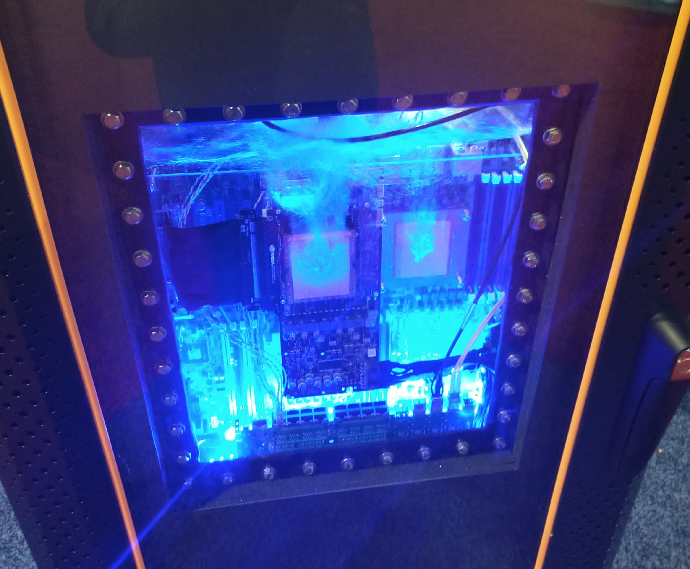

# SC17

Conference Recap

Levi Baber

http://rit.las.iastate.edu

---

# Themes / Trends / Buzzwords

* Containers
* Reproducibility
* Traditional HPC / BigData / DL convergence
* Interactivity / UX
* GPU / TPU processing
* Configuration Management / Systems monitoring
* Heterogeneous hardware
* ARM
* Exascale

???

Sessions I attended:

* 20171112: HUST-17: https://hust17.github.io/
* 20171112: Best Practices in HPC training: https://sites.google.com/a/lbl.gov/hpc-training-best-practices/workshops/sc17
* 20171113: HPC System Professionals Workshop: http://hpcsyspros.lsu.edu/
* 20171114: How Serious Are We About the Convergence Between HPC and Big Data?: https://sc17.supercomputing.org/presentation/?id=pan128&sess=sess256
* 20171114: Reproducibility and Uncertainty in High Performance Computing: http://sc17.supercomputing.org/presentation/?id=pan121&sess=sess254
* 20171114: Usability, Scalability and Productivity on Many-Core Processors: Intel Xeon Phi: http://sc17.supercomputing.org/presentation/?id=bof128&sess=sess368
* 20171115: Practical Reproducibility by Managing Experiments Like Software: https://sc17.supercomputing.org/presentation/?id=bof177&sess=sess346
* 20171115: Blurring the Lines High-End Computing and Data Science: http://sc17.supercomputing.org/presentation/?id=pan105&sess=sess247
* 20171116: Common Big Data Challenges in Bio, Geo, Climate, and Social Sciences: https://grid.cs.gsu.edu/~tcpp/SC2017/
* 20171116: BeeGFS - Architecture, Implementation Examples, and Future Development: https://www.beegfs.io/content/sc17-bof/

---

# Hardware

* Omnipath, Infiniband, Ethernet
  * Omnipath seems to be gaining
  * Still some debate abbout offload/onload
  * Low latency / HighBW Ethernet ok for small clusters (=<64 nodes)
* Water cooling likely required for HPC using latest gen procs
* ARM - ThunderX gaining ground. Equivalent benchmarks on many workloads
* Lots of GPU dense deployments for Deep Learning
* FPGA - Gaining on GPUs for Deep Learning

???
Omnipath seems stable and growing. Don't see any issues with us continuing down that path.
Talked to Cisco engineer about low latency Ethernet. He's a major contributor to OpenMPI. Good for small clusters that might have mixed use (bursty registration example)
Lots of mixed workloads with GPU/TPU (tensor processing) and some FPGA.  Expect GPU needs to become higher, with denser configurations also leading to more heat load.
New processors expected to require water cooling for most HPC densities (particularly considering added load of GPUs).  Some interesting solutions to the potential for leaks, pressure monitoring, negative pressure, etc. http://www.chilldyne.com/liquid-cooling-technology/

---

# HPC / Big Data / Deep Learning Convergence

* Keep the data closer to the compute
* In situ and in transit data analytics, including ML
* Lots of talk about integration of modeling & ML (e.g. )
* Some disciplines are moving towards '[data commons]' for analytics - not all agree
  * https://gdc.cancer.gov/
  * https://www.braincommons.org/
* OpenStack for some workloads (e.g. [ChameleonCloud])
* Some workloads like HEP have been shown to run faster on a tightly coupled large system rather than distributed
* How can ML help manage the HPC environment ?
   * Scheduler optimization
   * Storage analysis / QOS

[ChameleonCloud]: https://www.chameleoncloud.org/
[data commons]: http://occ-data.org/

???
Do some preprocessing at the edge, do some on the IB cards, etc. Move the data once.

---

# Storage

* Lots of discussion around small file issues / QOS
  * Some interesting use of loopback filesystem with containers to overcome that
* Lustre
  * [Small files on MDT] - new in 2.11
* [BeeGFS]
  * good small file performance
  * high dirops at large scale
  * scales in pairs, metadata and storage can both be scaled (data ~ raid10)
  * involved in European Exascale projects
  * future: caching, target pools, snapshots, etc.
  * Probably good for a scratch system. Doesn't seem ready for long term storage yet.
* Burst Buffer
  * SSD cache closer to the compute
  * Auto migrate data during prologue
* Hyperconverged compute / storage
  * Permanent v. Ephemeral (e.g. BeeOND)
* Policy Engines (metadata cache / insight):
  * [Robinhood] - open source, tight integration with Lustre
  * [Starfish] - commercial

[BeeGFS]: https://www.beegfs.io
[Robinhood]:https://github.com/cea-hpc/robinhood/wiki
[Starfish]: http://storageconference.us/2017/Presentations/Farmer.pdf
[Small files on MDT]: http://wiki.lustre.org/Data_on_MDT

???
The latest dev version of Lustre (2.11) contains a feature for storing data on the meta data target, to reduce trips to the OST's. http://wiki.lustre.org/Data_on_MDT
Seems to be growing interest in storage policy engines to help manage really large file systems. Robinhood seems to have some new interest, and startups like Starfish are offering commercial solutions.
LocoFS wins for their name: http://storage.cs.tsinghua.edu.cn/~lu/pubs/sc17-locofs.pdf
IO / Compute may soon be crossing over in precedence: https://www.vi4io.org/io500/start

---

# Reproducibility / Replicability

* I went to several sessions on this topic
* Tools like [Spack] and [Singularity] will make this easier for the researchers
* Post upgrade testing - saw several tools, none of which were perfect / production ready
  * Can we use Singularity or Spack with CI to do this testing more effectively?
  * Purdue plans to release their [Testpilot] tool as open source
* Some concern about cpu arch & compiler differences
* Most concern about software stack and access to data & methods
* [Open Science Framework] got some small mention, but more focus on [Popper]

[Spack]:http://spack.readthedocs.io
[Singularity]: http://singularity.lbl.gov/
[Testpilot]: https://dl.acm.org/citation.cfm?doid=3152493.3152555
[Open Science Framework]:https://osf.io/
[Popper]:http://falsifiable.us/

---

# Job Scheduling (SLURM)

* [DMTCP] Checkpointing / [Job Suspsension with SLURM]
* [RC 17.11.0-0rc3] supports federated clusters
* Licenses can easily be managed as trackable resources (TRES)
* TACC did some work on a tool to add checkpointing, not production ready: [ITALC]

[DMTCP]: http://dmtcp.sourceforge.net/
[Job Suspsension with SLURM]: https://slurm.schedmd.com/SLUG17/ciemat-cr.pdf
[RC 17.11.0-0rc3]: https://download.schedmd.com/slurm/slurm-17.11.0-0rc3.tar.bz2
[ITALC]:https://www.tacc.utexas.edu/research-development/tacc-projects/italc

???
Several people I talked to said they'd tried job suspension with BLCR and had issues, but that DMTCP works well.
Federated clusters is a new feature that allows jobs to be submitted to multiple clusters and they coordinate with one another as peers.

---
# Containers

* Lot of attention for ease of software install & replicability
* [Docker], [Shifter], and [Charliecloud], but Singularity seems to have the most momentum
  * [Singularity]: No daemon, runs in userland, allows for untrusted containers, seems to have best MPI support
  * 2.4 adds support for [SCI-F] which provides better modularity
  * Could encrypted container images help meet compliance guidelines for standards like NIST800-171 ?
  * Future:
      * Checkpoint restarting that will be added as a layer to the sci-f file
      * Native Kubernetes support
      * OSX and Windows support
  * Nextflow which supports Docker and Singularity images looks interesting
* Portability for people moving from local compute to Xsede or other national resources is a big benefit

[Shifter]:https://github.com/NERSC/shifter
[Charliecloud]: https://github.com/hpc/charliecloud
[Singularity]: http://singularity.lbl.gov
[Docker]: https://www.docker.com/
[SCI-F]: http://containers-ftw.org/SCI-F/
[Nextflow]: https://www.nextflow.io/

???
Fun fact: Greg Kurtzer who created Singularity also started Warewulf and CentOS https://gmkurtzer.github.io/
Some people are using Docker Swarm or Kubernetes on HPC. Seems to be in the minority and have more security risks than Singularity.

---

# Interactivity / UX

## Interactivity
* Need for interactive jobs growing as data & visualization needs outgrow desktops
* Setting different expectations for cluster utilization (how much science got done vs. being 90% utilized)
* [MIT Lincoln Lab] runs independent servers for interactive use (much like BioCrunch, Speedy, etc.)

[MIT Lincoln Lab]: https://www.ll.mit.edu/about/about.html

## User Experience / Training / Onboarding
* General consensus that HPC needs to be easier for new users
* Some good ideas:
  * Paired up mentoring with experienced users
  * [Parallware] & [HPC Sonar] to help with code parallelization
* Developing a [HPC Carpentry] curriculum for new user training
  * Provide some incentive for completion (badges, higher queue priority, etc.)
* Growing demand for tools like Jupyter Notebok

[Parallware]: https://www.parallware.com/
[HPC Sonar]: http://www.hpcsonar.com/
[HPC Carpentry]:https://github.com/hpccarpentry

---

# Open Problems

* small files
* storage performance insight
* storage locality
* long running jobs
* interactive jobs
* non-traditional workloads

---
# How I see our role in HPC:

We shouldn't run a small traditional supercomputer, we'll lose that game.
We're not going to go to Exascale.  The majority of our users are not running
large model simulations, they're doing data analysis.  We should be a springboard
for getting people started, user support, and filling the niches for edge
cases that large centers can't.

* Bandwidth > latency
* Immediacy > Utilization efficiency
* Researcher time > computer time
* Support for non-traditional HPC workloads (BigData, ML, interactive)
* Need to do a better job of offloading to national resources as they scale up
