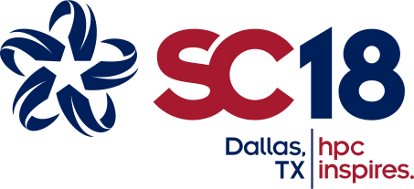
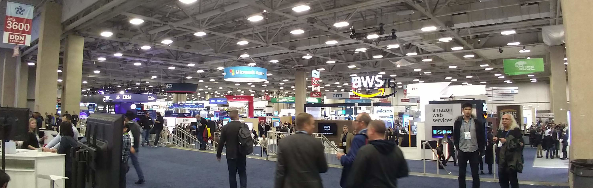
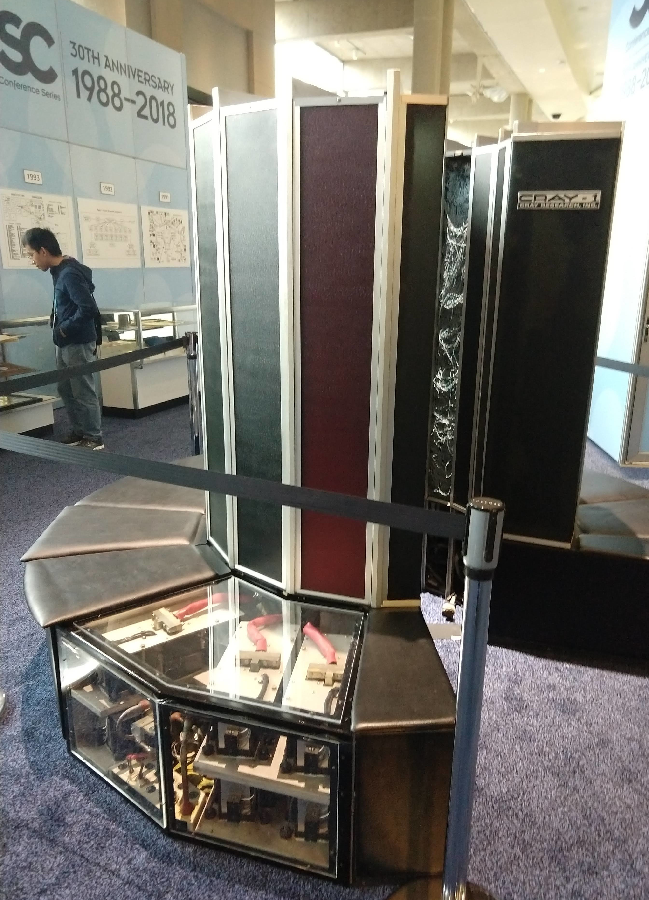
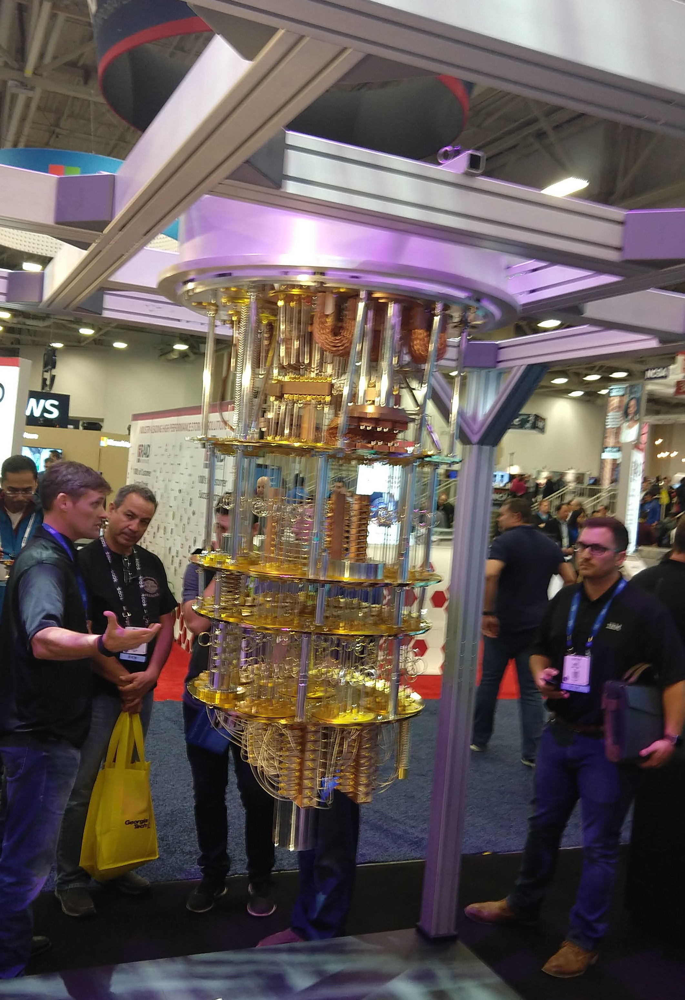
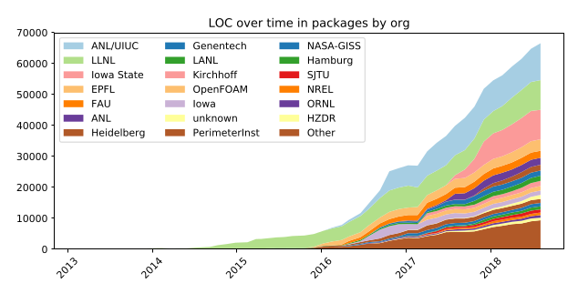
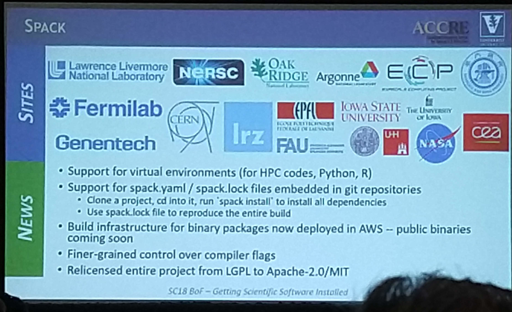

# SC18

Conference Recap

Levi Baber

http://rit.las.iastate.edu
---
layout: true
class: footer-logo
---

## Conf Overview
* ~13K people
* Attended >[20 sessions] over 5 days
* Gave a [lightning talk] to Xsede Campus Champions

### Themes & trends
* Data growth & storage
* Simplifying software installs
* Reproducibility
* Containers

### Highlights
* User support: More users are entering HPC, not as technically proficient - need to meet their needs
* Hardware: Continued emphasis on GPU, FPGA
* Hardware: Emerging recognition that memory bandwidth and IOPS are becoming more important than increased FLOPS
* Funding: Discussed models with other university research computing staff

[20 sessions]: https://github.com/baberlevi/sc18_notes
[lightning talk]: https://researchit.github.io/RIT-Presentations/sc18_cc_lightning_talk/

---

## Software packaging with Spack

We've been using [Spack] to build scientific software for about a year

Spack is growing quickly:

Currently contains ~3K packages

ISU got some recoginition during a couple different BoF sessions:

Please let me know if you're interested in helping to build packages for Spack (can be used on Linux or Mac)

[Spack]: https://spack.io
---